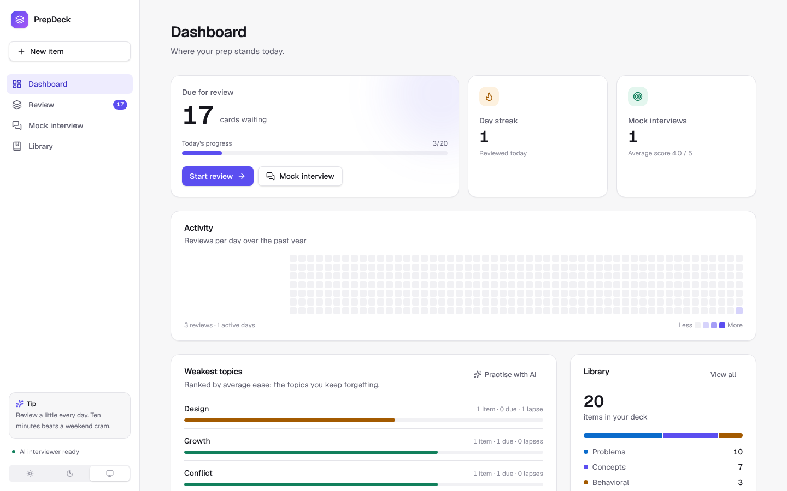
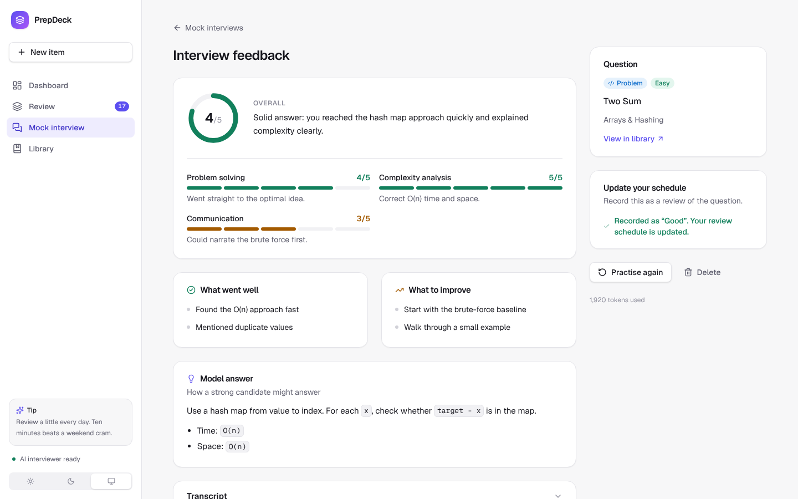
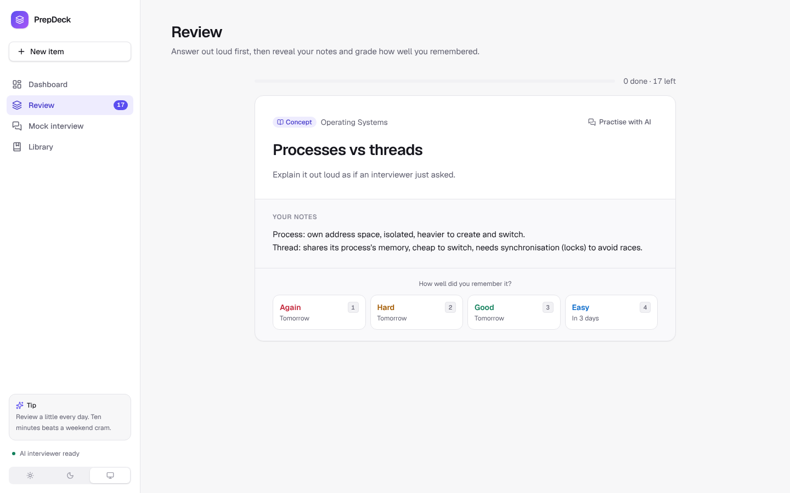
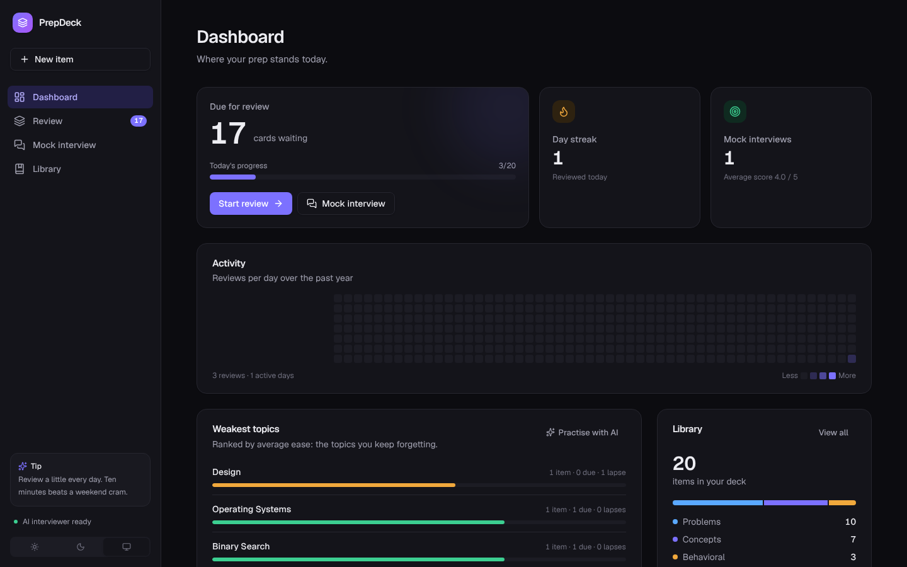
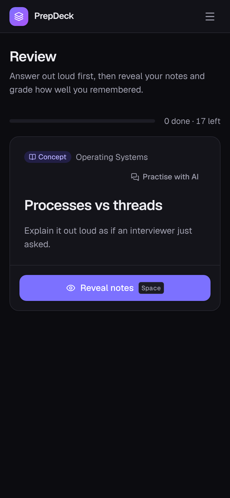

# PrepDeck

**Interview prep that remembers what you'll forget, plus an AI interviewer to practise with.**

PrepDeck is a spaced-repetition trainer for technical interviews. Log the coding
problems you've solved, the CS concepts you need to explain, and your behavioral
(STAR) stories. PrepDeck schedules each one for review just before you'd forget
it. When you want to rehearse for real, an AI mock interviewer asks the question,
follows up on your answers, and scores you, and that score feeds straight back
into your review schedule.



| AI interview feedback | Review session |
| --- | --- |
|  |  |

| Dark mode | Mobile |
| --- | --- |
|  |  |

## Features

**Spaced repetition**
- Three kinds of item: coding problems (difficulty, link), concepts, and behavioral stories, with Markdown notes.
- Reviews scheduled with a simplified **SM-2** algorithm (the one behind Anki). Grade each recall Again / Hard / Good / Easy; each button previews when you'll see the item next.
- Keyboard-first: <kbd>Space</kbd> reveals your notes, <kbd>1</kbd>–<kbd>4</kbd> grades.

**AI mock interviewer** (optional, powered by Claude)
- A realistic interviewer for the chosen question, tuned to its type: it probes complexity and edge cases for coding problems, depth and trade-offs for concepts, and specifics and ownership for STAR stories.
- Replies **stream** in token by token. Answer by typing or by **voice** (browser speech recognition, no extra cost).
- At the end you get a **scored feedback report**: overall score, rubric dimensions, strengths, improvements, and a model answer, generated as validated structured output.
- One click records the result as a review, so the interview updates your spaced-repetition schedule.

**Dashboard**
- Cards due today and progress, a review streak, a year-long activity heatmap, and topics ranked by how often you forget them (MongoDB aggregation pipelines).

**Polish**
- Light, dark and system themes with no flash on load, a responsive layout with a mobile drawer, accessible dialogs and form errors, toasts, skeleton loading states and empty states.

## Tech stack

| Layer | Choice |
| --- | --- |
| Framework | Next.js 16 (App Router, Server Components, Server Actions, Partial Prerendering) |
| Language | TypeScript (strict) |
| Database | MongoDB + Mongoose |
| AI | Claude API via `@anthropic-ai/sdk` (streaming, structured outputs, prompt caching) |
| Validation | Zod (forms, env, API input, AI output schema) |
| UI | Tailwind CSS v4 with semantic design tokens, Geist font, Lucide icons, Sonner toasts |
| Testing | Vitest unit tests; Playwright end-to-end walkthrough |
| CI | GitHub Actions: dependency audit, lint, typecheck, test, build |

## Architecture

```
src/
├── app/
│   ├── page.tsx                       Dashboard
│   ├── review/                        Spaced-repetition session
│   ├── items/                         Library: list, detail, new, edit
│   ├── interview/                     Mock interview hub, session page, server actions
│   ├── api/interviews/[id]/turn/      Streaming endpoint for interviewer replies (NDJSON)
│   ├── api/health/                    Health check (database ping)
│   └── actions.ts                     Item create / update / delete / review
├── components/                        UI: design-system primitives, shell, interview room…
├── lib/
│   ├── srs.ts                         SM-2 scheduler (pure, unit tested)
│   ├── stats.ts, validation.ts        Streaks, form schema (unit tested)
│   ├── data.ts, interviews.ts         Queries and aggregations
│   ├── reviews.ts                     Shared "record a review" logic
│   ├── env.ts                         Validated environment config
│   └── ai/                            Client, prompts, feedback schema, rate limits
└── models/                            Item, Review, Interview, UsageCounter
```

### Design decisions

- **Data model.** An `Item` embeds its scheduling state (`ease`, `interval`, `reps`, `lapses`, `dueAt`) because it is always read and written with the item. Reviews and interviews live in their own collections: they grow without limit and are queried by date.
- **Interview transcripts are append-only.** Each interview snapshots its question and freezes its system prompt at creation. Assistant turns are stored as the exact content blocks the API returned and replayed verbatim. This keeps the conversation valid for the API (thinking blocks must not be edited) and keeps the prompt cache warm.
- **Resilient streaming.** If the browser disconnects mid-reply, the server finishes generating and saves the reply anyway. A per-interview lock stops two tabs from streaming at once, and a reload mid-reply recovers automatically.
- **Structured feedback.** The feedback report is requested as JSON that matches a Zod schema, so the UI never parses free text.
- **Cost controls.** AI is optional (the app runs fully without a key). Daily caps per client and per app protect a public deployment, chat turns run at low effort, and server-side model fallback is enabled.
- **Rendering.** Pages prerender a static shell (navigation, headings, skeletons), and database-backed parts stream in through `<Suspense>`. Mutations are Server Actions that revalidate what they change.

## Running locally

You need Node 22+ and MongoDB (local, Docker, or a free [Atlas](https://www.mongodb.com/atlas) cluster).

```bash
docker run -d -p 27017:27017 --name prepdeck-mongo mongo:8   # or use Atlas

cp .env.example .env.local    # add ANTHROPIC_API_KEY to enable the AI interviewer
npm install
npm run dev
```

Open http://localhost:3000 and click **Load the starter pack** for 20 sample items.

### Environment variables

| Variable | Required | Default | Purpose |
| --- | --- | --- | --- |
| `MONGODB_URI` | no | `mongodb://127.0.0.1:27017/interview-prep` | Database connection |
| `ANTHROPIC_API_KEY` | no | (unset) | Enables the AI interviewer |
| `ANTHROPIC_MODEL` | no | `claude-sonnet-5-5` | Model for interviews and feedback |
| `AI_DAILY_LIMIT` | no | `300` | Max AI calls per day for the whole app |
| `AI_PER_CLIENT_DAILY_LIMIT` | no | `60` | Max AI calls per day per client IP |

### Scripts

```bash
npm run dev         # development server
npm test            # unit tests
npm run lint
npm run typecheck
npm run build && npm start
```

## Deploying

Vercel plus MongoDB Atlas (free tier) works well:

1. Create an Atlas cluster and allow Vercel's IPs (or `0.0.0.0/0`) under Network Access.
2. Import the repo into Vercel and set `MONGODB_URI`, plus `ANTHROPIC_API_KEY` for AI.
3. In the Anthropic Console, set a monthly spend limit. A mock interview costs a few cents.

`GET /api/health` returns `200` when the database is reachable, for uptime checks.

## Roadmap

- [ ] Accounts (Auth.js), so each user has a private deck. The app is currently single-user; don't expose it publicly without adding this.
- [ ] Paste a job description and get a generated study plan and items
- [ ] Import solved problems from a LeetCode profile
- [ ] User time zones for streaks (currently UTC)
